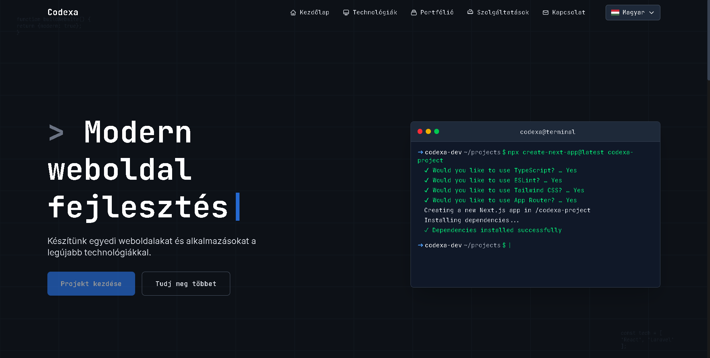

# Codexa - Modern Web Development Portfolio



A modern, responsive portfolio website built with Next.js, featuring a sleek dark theme and professional contact system.

## 🚀 Features

- **Modern Design**: Dark theme with smooth animations and responsive layout
- **Multilingual Support**: Hungarian and English language switching
- **Contact System**: Custom email integration with Mailcow SMTP
- **Portfolio Showcase**: Interactive project gallery with live website links
- **Professional Deployment**: Production-ready with PM2 and Nginx configuration

## 🛠 Tech Stack

- **Frontend**: Next.js 15.5.2, React, TypeScript, Tailwind CSS
- **Email**: Nodemailer with custom SMTP (Mailcow)
- **Deployment**: PM2, Nginx, Ubuntu VPS
- **Development**: ESLint, PostCSS, Toast notifications

## Getting Started

First, install dependencies:

```bash
npm install
```

Run the development server:

```bash
npm run dev
```

Open [http://localhost:3000](http://localhost:3000) with your browser to see the result.

## 📧 Email Configuration

The project uses a custom email system with Mailcow SMTP. Configure your environment variables:

```env
SMTP_HOST=your-mail-server.com
SMTP_PORT=587
SMTP_USER=your-email@domain.com
SMTP_PASS=your-password
```

## 🌍 Deployment

The project includes comprehensive deployment scripts and documentation:

- `deploy.sh` - Basic deployment script
- `deploy-advanced.sh` - Enterprise deployment with rollback
- Complete VPS setup documentation in `/docs`

## 📱 Contact

- **Website**: [codexa.hu](https://codexa.hu)
- **Email**: info@codexa.hu
- **Phone**: +36 20 662 1348

---

Built with ❤️ by Codexa Team
